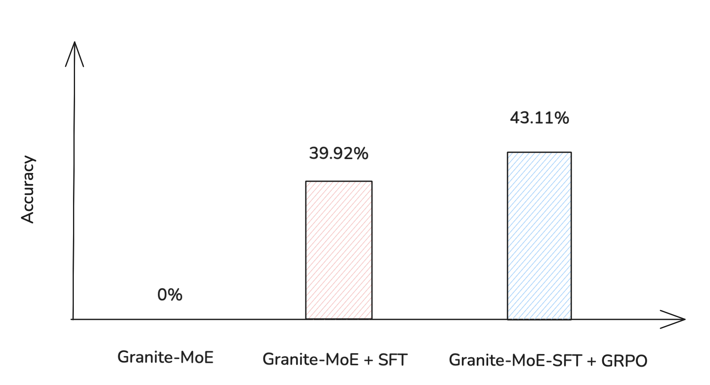
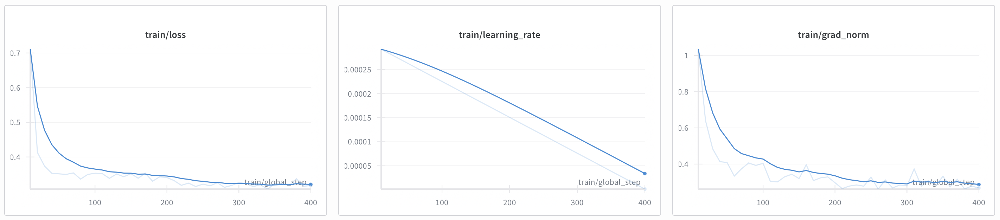
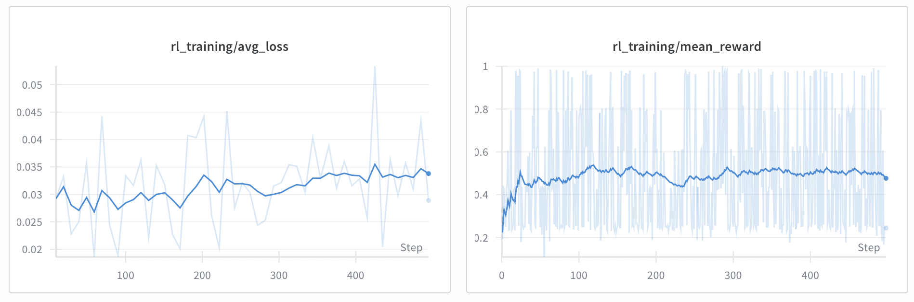
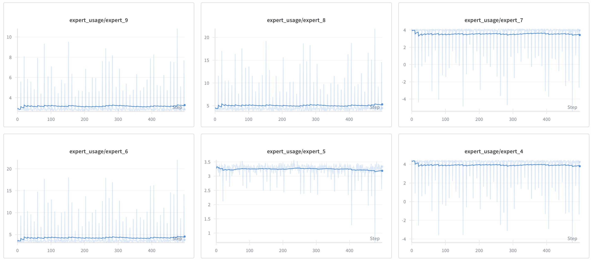
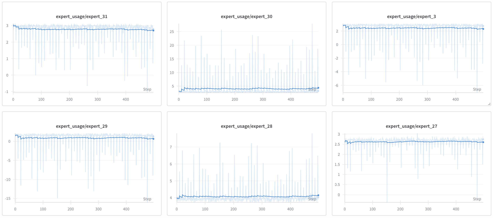
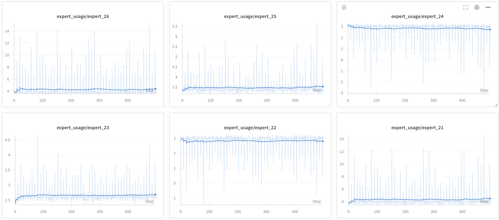
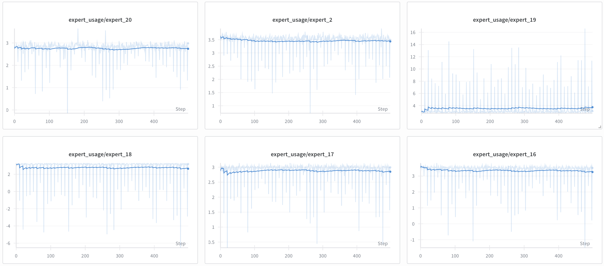
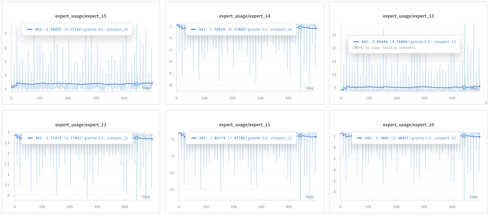
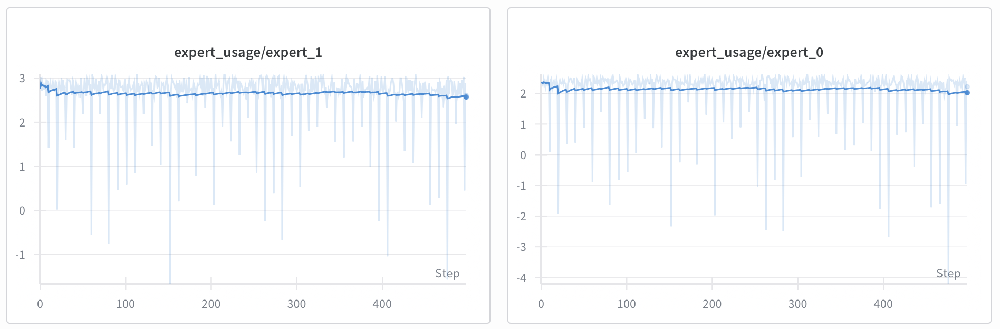

# MLE Assignment: MoE + RL for Mathematical Reasoning

## Table of Contents
- [Overview](#overview)  
- [Approach](#approach)  
  - [1. Model Selection & Adaptation](#1-model-selection--adaptation)  
  - [2. Supervised Fine-Tuning (SFT)](#2-supervised-fine-tuning-sft)  
  - [3. Reinforcement Learning (GRPO)](#3-reinforcement-learning-grpo)  
- [Results](#results)  
- [Repository Structure](#repository-structure)  
- [How to Run](#how-to-run)  
  - [1. Environment Setup](#1-environment-setup)  
  - [2. Supervised Fine-Tuning (SFT)](#2-supervised-fine-tuning-sft-1)  
  - [3. Reinforcement Learning (GRPO)](#3-reinforcement-learning-grpo-1)  
- [Evidence & Logs](#evidence--logs)  
- [Design Decisions](#design-decisions)  

---

## Overview
This repository contains my solution to the MLE assignment: a PyTorch training pipeline that fine-tunes a **Mixture of Experts (MoE)** model using **Reinforcement Learning (RL)** on the GSM8K mathematical reasoning dataset. The goal is to improve reasoning quality and answer correctness.

---

## Approach

### 1. Model Selection & Adaptation
- **Model**: IBM Granite 3.0-1B-a400m, a compact MoE LLM suitable for a single RTX 3080/4080 GPU.  
- **LoRA**: Low-Rank Adaptation enables **parameter-efficient fine-tuning** without updating full model weights.

### 2. Supervised Fine-Tuning (SFT)
Direct RL on a pretrained LLM fails on GSM8K because the model does not know the output structure. SFT ensures the model learns the proper reasoning + answer format.  

- **Formatting**: Each problem is converted to a chat template with `<think>reasoning</think><answer>number</answer>`.  
- **LoRA Training**: Fine-tunes the model on GSM8K with structured outputs, making it ready for RL.

### 3. Reinforcement Learning (GRPO)
- **Algorithm**: Generalized Reward Policy Optimization (GRPO), a policy-gradient RL method.  
- **Environment**: Custom Gymnasium wrapper around GSM8K, handling prompts and response evaluation.  
- **Reward Function**:

$$
\text{reward} = 0.7 \cdot \text{correctness} + 0.15 \cdot \text{format} + 0.15 \cdot \text{BERTScore}
$$

  - **Correctness**: 1.0 if predicted answer matches gold, else 0.0  
  - **Format**: 1.0 if reasoning + answer are properly structured  
  - **Reasoning Similarity**: BERTScore F1 between predicted and gold reasoning  

- **GRPO Loss**: Clipped policy gradient loss (similar to PPO):

$$
\text{ratio} = \exp(\log \pi_\theta(a|s) - \log \pi_{\text{old}}(a|s)), \quad
\text{loss} = -\min(\text{ratio} \cdot \text{advantage}, \text{clip}(\text{ratio}, 1-\epsilon, 1+\epsilon) \cdot \text{advantage})
$$

- **Expert Usage Monitoring**: Logs per-step MoE expert counts and percentages to understand routing behavior.

---

## Results

| Stage                    | Accuracy (%) | Notes |
|---------------------------|-------------|-------|
| Base MoE                  | 0.0         | Cannot solve GSM8K directly. |
| SFT + LoRA                | 39.92       | Learns structured reasoning and answers. |
| GRPO (RL fine-tuning)     | 43.11       | Improves correctness, reasoning quality, and formatting. |





**Key Observations**
1. **SFT is essential**: Direct RL on the base model fails completely.  
2. **RL provides incremental gains**: GRPO improves accuracy by ~3 points and refines reasoning.
3. **Training efficiency**: With only **0:38:40** of SFT training (as shown in the notebook training cell) and **1:21:25** of GRPO training (as shown in the GRPO training notebook), giving a **total of 1 hour 59 minutes and 5 seconds**, we obtained a compact MoE model capable of reasoning with **43.11% accuracy** on GSM8K.


---

## Repository Structure
```
├── checkpoints/                   # Saved model and adapter checkpoints
├── notebooks/
│   ├── moe-sft-training.ipynb      # Supervised fine-tuning notebook
│   ├── moe-rl-training.ipynb       # RL (GRPO) training notebook
│   └── ...
├── utils/
│   ├── dataset.py                # GSM8KEnv Gym environment, parsing, reward computation for GSM8K
│   ├── grpo.py                   # GRPO RL algorithm: experience collection, loss, and training utilities
│   └── __init__.py
├── wandb/                         # training logs created by Weights & Biases
├── requirements.txt               # Python dependencies
├── README.md                      # This file
└── ...
```

### utils/
The `utils/` directory contains core logic for environment, data handling, and RL training:
- `dataset.py`: Implements the `GSM8KEnv` Gymnasium environment for GSM8K, as well as parsing and reward computation utilities for mathematical reasoning tasks.
- `grpo.py`: Implements the Generalized Reward Policy Optimization (GRPO) RL algorithm, including experience collection, GRPO loss calculation, and batch training utilities.
These modules keep the main notebooks clean and modular, and can be reused for other similar RL or MoE projects.

---

## How to Run

### 1. Setup Environment

```bash
python3 -m venv venv
source venv/bin/activate
pip install -r requirements.txt
```

### 2. Supervised Fine-Tuning (SFT)
- Open `notebooks/moe-sft-training.ipynb` and run all cells to train LoRA adapters on GSM8K.
- This will save LoRA checkpoints in `checkpoints/`.


### 3. Reinforcement Learning (GRPO)
- Open `notebooks/moe-rl-training.ipynb` and run all cells.
- The notebook will load the SFT-adapted model and further train it with RL.
- Checkpoints and logs will be saved automatically.

### Inference example

You can load and use the trained LLM for inference as follows:


```python
from peft import PeftModel
from transformers import AutoModelForCausalLM, AutoTokenizer

# Load base model
model = AutoModelForCausalLM.from_pretrained("ibm-granite/granite-3.0-1b-a400m-base", device_map="auto")
# Load LoRA adapter
llm = PeftModel.from_pretrained(model, "../checkpoints/granite-1b-a400m-blue-yonder-grpo-3")
tokenizer = AutoTokenizer.from_pretrained("../checkpoints/granite-1b-a400m-blue-yonder-grpo-3", local_files_only=True)

# Inference
prompt = "<your formatted GSM8K prompt>"
inputs = tokenizer(prompt, return_tensors="pt").to("cuda")
output = llm.generate(**inputs, max_new_tokens=128)
print(tokenizer.decode(output[0], skip_special_tokens=True))
```

---

## Evidence & logs

- Training logs, metrics, and expert usage plots are available in `wandb/`. These contain detailed information about model performance, reward curves, and RL metrics.

- Checkpoints in `checkpoints/` can be used to reproduce experiments or continue training from intermediate states.

💡 **To check WandB logs locally:**

Start the local WandB dashboard:
```bash
wandb local
```

Open your browser at http://localhost:8080 to view:
- Training metrics
- Reward/loss curves
- Expert usage plots
- Associated checkpoints

This allows you to explore the logs and reproduce experiments entirely offline, using the existing wandb/ folder.

### SFT Training logs

- Training loss



### GRPO Training logs

- Training reward and loss


- Expert usage







---

## Design Decisions

- **Why IBM Granite?**: Small, efficient, and open MoE model suitable for consumer GPUs.
- **Why LoRA?**: Enables efficient SFT and RL without full model retraining.
- **Why SFT before RL?**: Ensures the model learns the required output structure before RL fine-tuning.
- **Why GRPO?**: Simple, effective RL algorithm for policy optimization.
- **Expert Monitoring**: Provides insight into MoE routing and model behavior.

---
